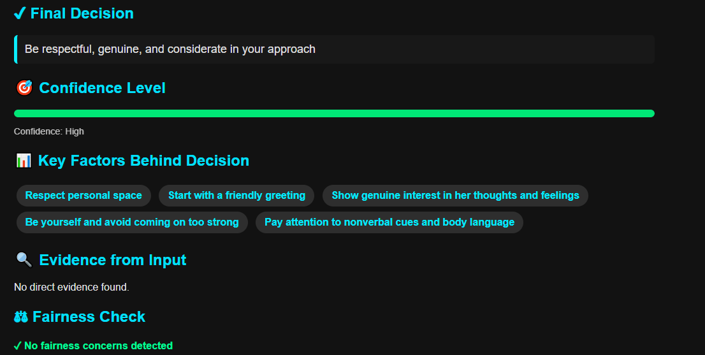
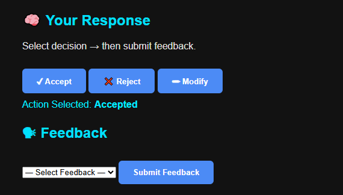

# 🧠 Explainable AI Decision Assistant

A production-oriented **Python backend application** that analyzes documents and user inputs to generate **transparent, explainable AI-driven decisions**.

The system focuses on **interpretability**, combining deterministic rules with GenAI models to provide **human-readable reasoning instead of black-box outputs**.

---

## 🚀 Project Overview

The Explainable AI Decision Assistant supports decision-making workflows by:

- Ingesting unstructured documents (PDF, DOCX, TXT)
- Extracting and preprocessing relevant content
- Applying AI-assisted reasoning
- Returning **structured, explainable outputs** that justify each decision

The project emphasizes **clarity, reliability, and real-world usability**.

---

## 🎯 Key Features

- **Document Ingestion** – PDF, DOCX, TXT support with validation  
- **Explainable Decision Logic** – Rule-based reasoning + GenAI  
- **Structured Outputs** – Machine-readable, consistent responses  
- **Backend-First Design** – Modular Flask application  
- **Production Practices** – Logging, error handling, env-based config  

---

## 🏗️ System Architecture

1. **Input Layer** – Document upload or text input  
2. **Preprocessing** – Text extraction and cleaning  
3. **AI Reasoning Layer** – Rules + GenAI inference  
4. **Explainability Layer** – Human-readable reasoning  
5. **Response Layer** – Structured JSON output  

---

## 🖼️ Application Screenshots

### Explainable Output View


### Document Analysis Workflow


### Structured Decision Response


---

## 🛠️ Tech Stack

- **Language:** Python  
- **Backend:** Flask  
- **AI / NLP:** GenAI integration, rule-based reasoning  
- **Data Handling:** PDF/DOCX/TXT parsing  
- **Config:** Environment variables (`.env`)  
- **Version Control:** Git  

---

## 📁 Project Structure

```text
XAI_DECISION_ASSISTANT/
│
├── app.py                  # Application entry point
├── core_api.py              # Core decision & reasoning logic
├── config_openrouter.py     # AI provider configuration (env-based)
├── requirements.txt         # Dependencies
├── README.md                # Documentation
├── .gitignore               # Git ignore rules
│
├── templates/               # HTML templates
├── static/                  # CSS and static assets
├── images/                  # Screenshots
│   ├── XAI-1.png
│   ├── XAI-2.png
│   └── XAI-3.png
└── logs/                    # Runtime logs (ignored in Git)

⚙️ Setup & Run Locally
git clone https://github.com/koushik1124/XAI_DECISION_ASSISTANT.git
cd XAI_DECISION_ASSISTANT
python -m venv venv
source venv/bin/activate   # Windows: venv\Scripts\activate
pip install -r requirements.txt

Create a .env file:

OPENROUTER_API_KEY=your_api_key_here


Run:

python app.py

📌 Use Cases

Explainable decision-support systems

Document-driven analysis tools

AI systems requiring transparency and trust

👤 Author

Koushik Yadagiri
Python Engineer | Applied AI & Backend Systems

GitHub: https://github.com/koushik1124

LinkedIn: https://www.linkedin.com/in/koushik-yadagiri-bb3a14218
